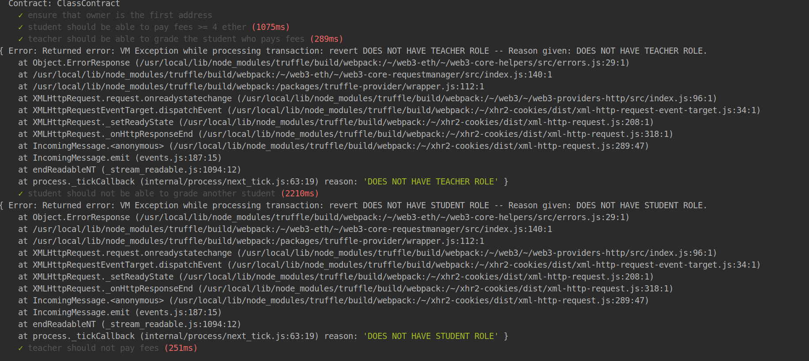
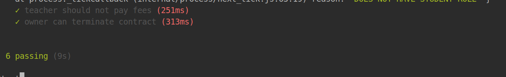
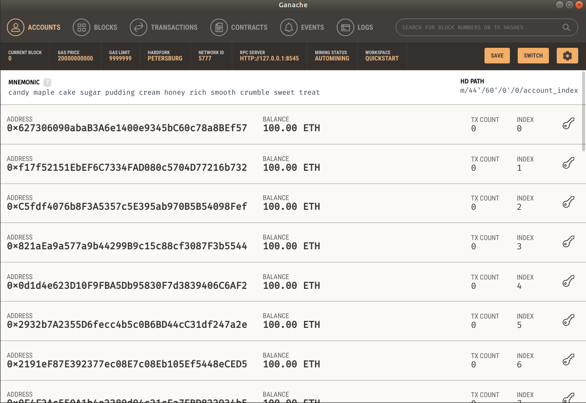
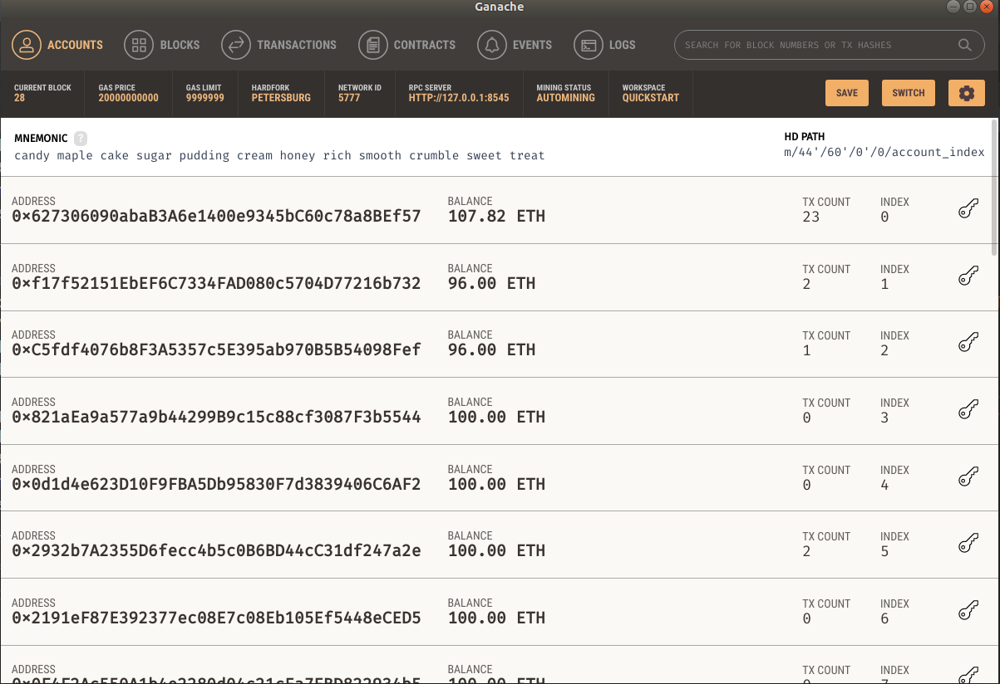

## Smart Contract Security and using OpenZeppelin

This repository demonstrates the use of [OpenZeppelin](https://openzeppelin.org/) for secure smart contracts. Here,
I only make use of `Ownable` contract and the `Roles` library.

## Ownable
The [Ownable](https://github.com/OpenZeppelin/openzeppelin-solidity/blob/master/contracts/ownership/Ownable.sol) contract ensures that the address that deploys the contract becomes the contract owner. It also has other
functions for transferring ownership from one address to another.

## Roles
[Roles](https://github.com/OpenZeppelin/openzeppelin-solidity/blob/master/contracts/access/Roles.sol) on the other hand is a a library and not a contract. It helps ensure that only particular accounts can execute 
certain functions if they have access to a particular Role.

## Example used.
The code in this repo simulates this using a class scenario where only students can pay fees while 
only a teacher can grade a student.As well, only the owner decides who becomes a student or a teacher and 
only him/her can choose to terminate the contract. Terminating the contract transfers all ether in the contract to
the contract owner.

## Screenshots
Here are the screenshots running tests

Here are the screenshots of Ganache before and after tests a run respectively

#### Before

#### After

